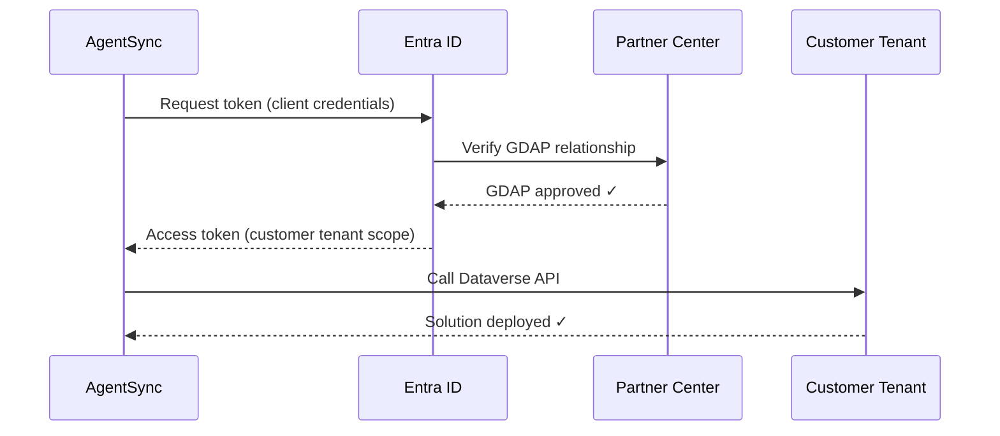

# AgentSync

Take your CoPilot agents and ship them to your clients' tenants! Multi-tenant Copilot Studio deployment automation for MSPs. Deploy agents from a source environment to hundreds of customer destinations using GDAP (Granular Delegated Admin Privileges). AgentSync works in a web-app, command-line tool (CLI), or as a Claude Skill.

[](https://vercel.com/new/clone?repository-url=https%3A%2F%2Fgithub.com%2Fpax8labs%2Fagentsync&env=PARTNER_TENANT_ID,PARTNER_CLIENT_ID,PARTNER_CLIENT_SECRET,SOURCE_TENANT_ID,SOURCE_ENVIRONMENT_URL&envDescription=Azure%20AD%20and%20source%20environment%20configuration&project-name=agentsync&repository-name=agentsync)

---

## ⚡ Quick Start: Deploy Agents to Multiple Tenants

### One-Time Setup (5-10 minutes)

1. **Create GDAP relationships** in [Microsoft Partner Center](https://partner.microsoft.com/en-us/dashboard/customers)
   - Go to Customers → [Customer] → Admin relationships
   - Request **Power Platform Administrator** role
   - Customer approves the relationship
   - _This is the only external step - everything else is done in AgentSync_

2. **Create Azure AD app registration** in your partner tenant
   - [Azure Portal](https://portal.azure.com/#view/Microsoft_AAD_RegisteredApps/ApplicationsListBlade) → App registrations → New registration
   - Add API permission: `Dynamics CRM > user_impersonation`
   - Create client secret and save it
   - Note: Client ID, Tenant ID, Secret

3. **Enter credentials in AgentSync**
   - Start AgentSync (see [installation options](#-try-it-in-5-minutes-no-install-required) below)
   - Go to Settings → Integration tab
   - Enter your partner credentials
   - Click "Test Connection" ✓

4. **Deploy agents!**
   - AgentSync auto-discovers all your GDAP customers
   - Select agent, select tenants, click Deploy
   - Monitor real-time progress across all tenants

**Time to first deployment:** ~15 minutes
**Time per subsequent deployment:** ~2 minutes (to 1 tenant or 100 tenants - same time!)

---

## 🚀 Try It in 5 Minutes (No Install Required)

**Already have GDAP set up with your customers?** You're 90% there.

> **📱 What You're Deploying**: AgentSync Control Tower - a Next.js web dashboard for managing Copilot Studio agent deployments across your customer fleet. It includes the full UI, approval workflows, health checks, and deployment tracking.
>
> **✅ Production Ready**: Core deployment, approval workflows, audit logging, and health checks are production-ready. [Some enhancements](https://github.com/pax8labs/agentsync/issues) are still in progress (UI design system updates, enhanced telemetry, wave orchestration).

### Option A: One-Click Cloud Deploy (Easiest)

Deploy the **Control Tower web dashboard** to **Vercel** - a free cloud hosting platform (like Azure App Service, but simpler). Good for testing and evaluation.

1. Click the **"Deploy with Vercel"** button above
2. Sign in with GitHub (create a free account if needed)
3. Fill in your credentials when prompted:
   - `PARTNER_TENANT_ID` - Your MSP's tenant ID
   - `PARTNER_CLIENT_ID` - Your app registration client ID
   - `PARTNER_CLIENT_SECRET` - Your app registration secret
   - `SOURCE_TENANT_ID` - Where your master agent lives
   - `SOURCE_ENVIRONMENT_URL` - e.g., `https://yourdev.crm.dynamics.com`
4. Click Deploy → Your Control Tower dashboard is live in ~2 minutes

To add customer tenants, either:

- Set `TENANTS_JSON` env var with a JSON array of tenants, OR
- Edit `config/tenants.yaml` in your forked repo (see [Configuration](#configuration))

**Production-ready?** Core functionality is production-ready. For batch deployments to your entire fleet (50+ tenants) or scheduled overnight rollouts, use [Docker](#option-2-docker---recommended-for-scale) instead for better parallel processing (Vercel free tier has 10-second timeout per request).

### Option B: Run Locally (5 commands)

Run the Control Tower web dashboard on your local machine:

```bash
git clone https://github.com/pax8labs/agentsync.git
cd agentsync
npm install -g pnpm           # Skip if you have pnpm
pnpm install && pnpm build
cp .env.example .env          # Then edit with your credentials
pnpm web                      # Opens Control Tower dashboard at localhost:3000
```

> **Note:** Local mode runs with SQLite for data persistence. Redis is optional for background job processing - without it, deployments run synchronously during web requests. Great for testing and small fleets.
>
> **Demo Mode**: Set `DEMO_MODE=true` in `.env` to test the UI with mock data (no Azure AD or customer tenants required).

**Need to deploy to 50+ tenants at once?** Skip to [Docker Setup](#option-2-docker---recommended-for-scale) for production-scale deployments with parallel processing.

---

## 📋 What You'll Need

| Requirement               | Who Sets This Up    | You Probably Have It If...             |
| ------------------------- | ------------------- | -------------------------------------- |
| GDAP relationships        | You (MSP admin)     | You manage customers in Partner Center |
| Azure AD App Registration | You or your IT team | You've done SSO or API integrations    |
| Power Platform Admin role | Customer approval   | Customers approved your GDAP request   |

**Don't have GDAP yet?** See [Prerequisites](#prerequisites) below for step-by-step setup.

---

## Features

### Core Capabilities

- **Multi-tenant deployment** - Deploy agents to 200+ tenants in parallel with rate limiting
- **GDAP authentication** - Secure cross-tenant access using Microsoft's delegated admin model
- **Three deployment interfaces** - Web UI, CLI, and Claude Code skill (with feature parity)
- **Job queue system** - Reliable shipments with retry logic and progress tracking
- **Tag-based targeting** - Ship to fleet groups (e.g., "enterprise", "pilot")
- **Comprehensive testing** - 140+ CLI tests, 7 E2E tests, 67% code coverage

### Advanced Features (v2.0)

- **SQLite Persistence** - Durable storage for deployments, approvals, and audit logs that survives restarts
- **Approval Workflows** - Multi-approver voting system with expiration and audit trail
- **Health Checks** - Validate tenant environments with persistent historical results
- **Audit Logging** - Complete audit trail of all deployment and approval actions
- **Connection Reference Mapping** - Automatically map connection references to target connections
- **Environment Variables** - Configure tenant-specific environment variables
- **Deployment Waves** - Staged rollouts with configurable parallelism and wait times
- **Rollback Capability** - Create snapshots before deployment, rollback on failure
- **Webhook Notifications** - Real-time notifications to external systems (Slack, Teams, etc.)
- **Scheduled Deployments** - Cron-based scheduling with maintenance windows
- **Solution Diff & Preview** - Compare solutions before deployment

## Architecture

**Vercel / Serverless (simple):**

```
┌─────────────────┐                          ┌─────────────────┐
│  Control Tower  │─────────────────────────▶│   Customer A    │
│     (Web)       │───────────┐              └─────────────────┘
└─────────────────┘           │              ┌─────────────────┐
                              └─────────────▶│   Customer B    │
                                             └─────────────────┘
```

**Docker / Self-hosted (scales to 200+ tenants):**

```
┌─────────────────┐     ┌─────────────────┐     ┌─────────────────┐
│   CLI / Control │────▶│   Dock Queue    │────▶│    Dockworker   │
│   Tower (Web)   │     │   (Redis)       │     │    (Worker)     │
└────────┬────────┘     └─────────────────┘     └────────┬────────┘
         │                                                │
         │                                                │
         └────▶ SQLite Database ◀────────────────────────┘
                (Deployments, Approvals, Audit Logs)

         │                          │                          │
         ▼                          ▼                          ▼
┌─────────────────┐       ┌─────────────────┐       ┌─────────────────┐
│   Customer A    │       │   Customer B    │       │   Customer C    │
└─────────────────┘       └─────────────────┘       └─────────────────┘
```

> **How it works:** Copilot Studio agents live in Microsoft Dataverse (the database behind Power Platform). AgentSync uses the Dataverse API to export your agent as a "solution" from your dev environment, then imports it into each customer's environment via GDAP.

## Prerequisites (Detailed)

### 1. Azure AD App Registration (One-Time)

**In your partner tenant [Azure Portal](https://portal.azure.com/#view/Microsoft_AAD_RegisteredApps/ApplicationsListBlade):**

1. Navigate to **Azure Active Directory** → **App registrations** → **New registration**
2. Configure:
   - Name: `AgentSync Deployment Tool`
   - Supported account types: **Accounts in any organizational directory (Multitenant)**
3. After creation, note these values:
   - **Application (client) ID** - You'll enter this in AgentSync settings
   - **Directory (tenant) ID** - Your partner tenant ID
4. **Create client secret:**
   - Certificates & secrets → New client secret
   - Copy the **value** immediately (shown only once!)
5. **Add API permissions:**
   - API permissions → Add a permission
   - **Dynamics CRM** → Delegated permissions → `user_impersonation`
   - Click "Grant admin consent" ✓
6. **Optional - for direct import:**
   - Add **Microsoft Graph** → Delegated → `DelegatedAdminRelationship.Read.All`
   - Add **PowerApps Service** → Delegated → `User`

### 2. GDAP Relationships (Per Customer)

**What is GDAP?** Microsoft's secure delegation model that lets you access customer tenants without storing their credentials.

**Setup in Partner Center:**

1. Sign in to [Microsoft Partner Center](https://partner.microsoft.com/en-us/dashboard/customers)
2. Navigate to **Customers** → Select your customer
3. Go to **Account** → **Admin relationships**
4. Click **"Request a delegated admin relationship"**
5. Configure:
   - Relationship name: `AgentSync Deployment Access`
   - Duration: 2 years (default)
   - Roles to request: ☑️ **Power Platform Administrator** (required)
6. Send invitation link to customer
7. Customer approves in their Microsoft 365 Admin Center
8. Status changes to **"Active"** ✓

**Once active, AgentSync automatically discovers this customer!** No manual tenant configuration needed.

### 3. Application User (Per Customer) - Optional

_Only needed if you encounter permission issues. Most MSPs with GDAP + Power Platform Admin role don't need this._

If required, in each customer's environment:

1. Power Platform Admin Center → Environments → [Environment] → Settings
2. Users + permissions → Application users → New app user
3. Add your partner app registration
4. Assign: System Administrator or Solution Import role

## Installation

Choose the option that matches your comfort level:

| Option                                             | Best For                      | Technical Skill   |
| -------------------------------------------------- | ----------------------------- | ----------------- |
| [Vercel (Cloud)](#option-1-vercel-cloud---easiest) | IT admins, quick setup        | ⭐ Beginner       |
| [Docker](#option-2-docker---recommended-for-scale) | Self-hosted, bulk deployments | ⭐⭐ Intermediate |
| [Local Development](#option-3-local-development)   | Developers, customization     | ⭐⭐⭐ Advanced   |

### Option 1: Vercel (Cloud) - Easiest

No servers to manage. Click the button at the top of this README, fill in your credentials, done.

**Limitations:** Vercel runs each deployment during the web request (no background worker). Works great for deploying to a few tenants at a time. For bulk "deploy to all 200 tenants overnight" scenarios, use Docker—it has a dedicated worker that processes deployments in parallel.

### Option 2: Docker - Recommended for Scale

```bash
# Clone the repository
git clone https://github.com/pax8labs/agentsync.git
cd agentsync

# Configure
cp config/tenants.example.yaml config/tenants.yaml
cp .env.example .env
# Edit both files with your values

# Start services (web dashboard + worker + Redis)
docker-compose up -d
```

Access Control Tower at `http://localhost:3000`

### Option 3: Local Development

For developers who want to customize or contribute:

```bash
# Install dependencies
pnpm install

# Build all packages
pnpm build

# Set environment variables
export PARTNER_CLIENT_SECRET="your-secret"

# Start Control Tower
pnpm web  # Runs at http://localhost:3000

# Optional: For background job processing with Redis
docker run -d -p 6379:6379 redis:7-alpine
pnpm worker  # In a separate terminal
```

> **Note:** The SQLite database is created automatically at `./data/agentsync.db` on first run. Redis is optional - without it, deployments run synchronously in the web process.

## Configuration

### Basic Configuration (`config/tenants.yaml`)

```yaml
version: "2.0"

partner:
  tenantId: "xxxxxxxx-xxxx-xxxx-xxxx-xxxxxxxxxxxx"
  clientId: "xxxxxxxx-xxxx-xxxx-xxxx-xxxxxxxxxxxx"

source:
  tenantId: "xxxxxxxx-xxxx-xxxx-xxxx-xxxxxxxxxxxx"
  environmentUrl: "https://your-dev-org.crm.dynamics.com"

tenants:
  - name: "Contoso Corporation"
    tenantId: "xxxxxxxx-xxxx-xxxx-xxxx-xxxxxxxxxxxx"
    environmentUrl: "https://contoso.crm.dynamics.com"
    tags: ["enterprise", "wave1"]
    enabled: true
```

### Connection Reference Mapping

Map source connection references to target connections for each destination:

```yaml
tenants:
  - name: "Contoso Corporation"
    tenantId: "..."
    environmentUrl: "..."
    connectionMappings:
      - sourceLogicalName: "cr_sharepoint_connection"
        targetConnectionId: "shared-sharepoint-contoso-xxx"
      - sourceLogicalName: "cr_outlook_connection"
        targetConnectionId: "shared-office365-contoso-xxx"
```

### Environment Variables

Configure tenant-specific environment variable values:

```yaml
tenants:
  - name: "Contoso Corporation"
    environmentVariables:
      - schemaName: "cr_SupportEmail"
        value: "support@contoso.com"
        type: "String"
      - schemaName: "cr_MaxRetries"
        value: 5
        type: "Number"
```

### Deployment Waves

Ship in stages with health checks between waves:

```yaml
settings:
  waves:
    - name: "Pilot"
      order: 1
      tenants: ["wave1", "priority"]
      maxParallel: 2
      waitAfterCompletion: "5m"
      continueOnFailure: false

    - name: "Main Rollout"
      order: 2
      tenants: ["wave2"]
      maxParallel: 10
      continueOnFailure: true
```

### Rollback Settings

Enable automatic snapshots and rollback capability:

```yaml
settings:
  rollback:
    enabled: true
    keepVersions: 3
    autoRollbackOnFailure: false
    rollbackTimeout: "10m"
```

### Webhook Notifications

Send notifications to external systems:

```yaml
settings:
  webhooks:
    - url: "https://hooks.slack.com/services/xxx"
      events:
        - deployment.started
        - deployment.completed
        - deployment.failed
        - tenant.failed
      secret: "${WEBHOOK_SECRET}"
      retries: 3
```

### Scheduled Deployments

Schedule deployments during maintenance windows:

```yaml
settings:
  schedule:
    cron: "0 2 * * 6" # Saturday at 2 AM
    timezone: "America/New_York"
    maintenanceWindow:
      start: "02:00"
      end: "06:00"
      daysOfWeek: [0, 6] # Weekend only
```

### Approval Workflow

Require approvals before deployment with multi-approver voting:

```yaml
settings:
  approval:
    required: true
    approvers:
      - admin@yourcompany.com
      - lead@yourcompany.com
    minApprovals: 2
    timeout: "24h"
    autoApproveForTags: ["test", "pilot"]
```

**Features:**

- Multiple approvers can vote (approve/reject) on each deployment
- Deployments proceed once minimum approvals are reached
- Any rejection immediately blocks the deployment
- Complete audit trail stored in SQLite database
- Approvals expire after configured timeout
- Real-time approval panel in Control Tower dashboard

### Environment Variables

| Variable                | Description                                   | Default                  |
| ----------------------- | --------------------------------------------- | ------------------------ |
| `PARTNER_CLIENT_SECRET` | Azure AD app client secret                    | Required                 |
| `DATABASE_PATH`         | SQLite database file location                 | `./data/agentsync.db`    |
| `REDIS_URL`             | Redis connection URL (optional for demo mode) | `redis://localhost:6379` |
| `CONFIG_PATH`           | Path to tenants.yaml                          | `./config/tenants.yaml`  |
| `WORKER_CONCURRENCY`    | Parallel deployments                          | `5`                      |
| `SNAPSHOTS_DIR`         | Directory for rollback snapshots              | `./snapshots`            |
| `DEMO_MODE`             | Enable demo mode (uses in-memory stores)      | `false`                  |

## CLI Usage

### Pack a Solution (Export)

```bash
# Pack as managed (default)
agentsync pack --solution "CustomerServiceAgent" --output ./agents/

# Pack as unmanaged
agentsync pack --solution "CustomerServiceAgent" --output ./agents/ --unmanaged
```

### Ship to Destinations (Deploy)

```bash
# Deploy to all enabled tenants
agentsync ship --solution ./agents/CustomerServiceAgent_managed.zip --all

# Deploy to tenants with specific tags
agentsync ship --solution ./agents/CustomerServiceAgent_managed.zip --tag enterprise

# Deploy to multiple tag groups
agentsync ship --solution ./agents/CustomerServiceAgent_managed.zip --tag enterprise --tag pilot

# Dry run (see what would be deployed)
agentsync ship --solution ./agents/CustomerServiceAgent_managed.zip --all --dry-run
```

### Track Shipment Status

```bash
# One-time status check
agentsync track --shipment <shipment-id>

# Watch for updates
agentsync track --shipment <shipment-id> --watch
```

### Manage Fleet (Tenants)

```bash
# List all destinations in your fleet
agentsync fleet list

# Filter by tag
agentsync fleet list --tag enterprise

# Validate GDAP access
agentsync fleet validate
```

### Deliver to Single Destination (Testing)

```bash
agentsync deliver --solution ./agents/CustomerServiceAgent_managed.zip --tenant <tenant-id>
```

## Control Tower (Web Dashboard)

Access at `http://localhost:3000`

- **Dashboard** - Overview stats, recent shipments, and pending approvals
- **Solutions** - Browse and pack solutions from your source environment (warehouse)
- **Fleet** - View configured destinations with health check status
- **Agents** - Manage deployed agents across your tenant fleet
- **Deployments** - List all deployments with real-time status and approval states
- **New Deployment** - Upload solution and select target destinations
- **Deployment Detail** - View per-destination progress, approval panel, retry failed, or rollback
- **Tenant Detail** - Run health checks, view deployment history, and manage connections

### Data Persistence

AgentSync uses SQLite for durable storage:

- **Deployment History** - Complete history of all deployments with batch tracking
- **Approval Records** - Full audit trail of approvals with voter information
- **Health Check Results** - Historical health check data for trend analysis
- **Audit Logs** - Comprehensive logging of all system actions
- **Rollback Snapshots** - Metadata for solution snapshots

The database is created automatically at `./data/agentsync.db` (configurable via `DATABASE_PATH` environment variable).

## 🤖 Claude Code Integration

AgentSync includes a native Claude Code skill for AI-powered deployment management directly from your terminal or IDE.

### What You Can Do

Ask Claude naturally about your deployments:

- "Show me all failed deployments"
- "Deploy ProductQA agent to Contoso"
- "What tenants have the support agent deployed?"
- "Check the health of all production tenants"

Or use slash commands:

- `/deployments` - View deployment status and identify issues
- `/deploy` - Create new deployment with guided workflow
- `/fix-failures` - AI-powered troubleshooting and remediation
- `/monitor` - Real-time deployment progress tracking

### Quick Start

The skill is included in the repository - just start using it:

```bash
# 1. Start AgentSync locally
pnpm web  # Runs at http://localhost:3000

# 2. In the same directory, ask Claude
"Show me deployment status"
"List all tenants"
"What agents are available?"
```

### How It Works

Claude Code reads the skill definition in `.claude/skills/agentsync.md` which provides:

- API endpoint documentation and authentication
- Common workflows and examples
- Error analysis patterns
- Response formatting guidelines

When you ask deployment-related questions, Claude automatically:

1. Recognizes the context (deployments, agents, tenants)
2. References the skill for guidance
3. Calls the AgentSync API (localhost:3000)
4. Presents results in a helpful, actionable format

### Demo Mode

In demo mode (`DEMO_MODE=true`), the API allows unauthenticated access for seamless Claude Code integration during development.

For production use, sign in to AgentSync in your browser first - Claude will use your authenticated session.

### Features

- **Natural language queries** - No command syntax to memorize
- **Context-aware** - Understands deployment workflows and relationships
- **Batch operations** - Deploy to multiple tenants at once
- **Error analysis** - AI-powered troubleshooting with specific remediation steps
- **Real-time monitoring** - Track deployment progress with live updates
- **Safe operations** - Confirms before destructive actions

### Example Workflows

**Check deployment status:**

```
You: "Show me failed deployments from today"
Claude: [Queries API, analyzes results]
        "You have 2 failed deployments:

        1. Contoso - Sales Agent - Missing GDAP permission
           → Solution: Request Power Platform Admin role in Partner Center

        2. Fabrikam - Support Agent - Connection reference not found
           → Solution: Verify SharePoint connection exists in target tenant

        Would you like me to retry these after you fix the issues?"
```

**Deploy an agent:**

```
You: "Deploy the new customer service agent to all enterprise tenants"
Claude: [Finds agent, identifies tenants with 'enterprise' tag]
        "Found 15 tenants with 'enterprise' tag. Creating deployment...

        Deployment #dep-xyz-123 started
        → Contoso: In progress (35%)
        → Fabrikam: Completed ✓
        → Adventure Works: In progress (62%)
        ...

        I'll monitor and notify you when complete."
```

### Publishing

The Claude Code skill is currently bundled with AgentSync. For information about making it available as a standalone package, see [Issue #61](https://github.com/pax8labs/agentsync/issues/61).

---

## 🔌 MCP Server (Claude Desktop, Cline, Cursor)

AgentSync also provides a **Model Context Protocol (MCP) server** for broader AI assistant integration beyond Claude Code. Use AgentSync with Claude Desktop app, Cline (VS Code), Cursor, and other MCP-compatible AI tools.

### Quick Install

```bash
# Install globally
npm install -g @agentsync/mcp-server

# Or run from source
cd packages/mcp-server
npm install && npm run build
```

### Configure for Claude Desktop

Add to your Claude Desktop config:

**MacOS**: `~/Library/Application Support/Claude/claude_desktop_config.json`
**Windows**: `%APPDATA%\Claude\claude_desktop_config.json`

```json
{
  "mcpServers": {
    "agentsync": {
      "command": "agentsync-mcp",
      "env": {
        "AGENTSYNC_API_URL": "http://localhost:3000"
      }
    }
  }
}
```

Restart Claude Desktop and the server will be available.

### Configure for Cline (VS Code)

In VS Code Cline settings:

```json
{
  "mcpServers": {
    "agentsync": {
      "command": "agentsync-mcp",
      "env": {
        "AGENTSYNC_API_URL": "http://localhost:3000"
      }
    }
  }
}
```

### Available Tools

The MCP server exposes these tools to AI assistants:

- `list_deployments` - View deployment history with status filtering
- `get_deployment_status` - Get detailed deployment progress
- `list_agents` - See available Copilot agents
- `list_tenants` - View customer tenants and their deployed agents
- `create_deployment` - Deploy agents to tenants
- `monitor_deployment` - Watch deployment progress in real-time
- `get_deployment_stats` - View success rates and statistics
- `retry_deployment` - Retry failed deployments

### Example Usage

Once configured, ask your AI assistant:

```
"Show me all deployments from today"
"Deploy ProductQA to Woodgrove Bank"
"Which tenants have the support agent?"
"Retry the most recent failed deployment"
```

### Documentation

See [`packages/mcp-server/README.md`](packages/mcp-server/README.md) for complete documentation, troubleshooting, and development guide.

---

## Testing & Quality Assurance

AgentSync has comprehensive test coverage across all interfaces:

### Test Coverage

- **CLI**: 140+ integration tests (67% coverage)
  - All commands tested (deploy, track, pack, etc.)
  - Demo mode verification
  - Error handling and edge cases
  - Run tests: `cd packages/cli && pnpm test`

- **Web App**: 7 E2E tests (Playwright)
  - Critical user workflows
  - Deployment creation and tracking
  - Approval workflow
  - Run tests: `cd packages/web && pnpm test:e2e`

- **Claude Skill**: 1 E2E test
  - API integration verification
  - Natural language query handling

### Running Tests

```bash
# Run all CLI tests
pnpm --filter @agentsync/cli test

# Run CLI tests with coverage
pnpm --filter @agentsync/cli test:coverage

# Run web E2E tests
pnpm --filter @agentsync/web test:e2e

# Run tests in demo mode (no credentials needed)
DEMO_MODE=true pnpm test
```

### Quality Standards

- **Linting**: ESLint + TypeScript strict mode
- **Type Safety**: Full TypeScript coverage
- **API Validation**: Zod schema validation
- **Error Handling**: Comprehensive error messages with troubleshooting hints
- **Audit Logging**: All operations logged to SQLite for compliance

## Project Structure

```
agentsync/
├── packages/
│   ├── core/           # Core warehouse logic
│   │   └── src/
│   │       ├── auth/         # GDAP + token management
│   │       ├── config/       # YAML config schema (v2.0)
│   │       ├── dataverse/    # Solution pack/ship + connection refs
│   │       └── services/     # Rollback, health checks, webhooks, waves
│   │
│   ├── cli/            # Command-line interface
│   │   └── src/commands/
│   │
│   ├── worker/         # Dockworker (BullMQ job processor)
│   │
│   └── web/            # Control Tower (Next.js dashboard)
│       └── src/
│           ├── app/              # Next.js app routes
│           ├── components/       # React components
│           └── lib/
│               ├── db.ts              # SQLite database client
│               ├── db-schema.sql     # Database schema
│               └── repositories/     # Data access layer
│
├── config/
│   └── tenants.yaml    # Your fleet configuration
├── data/               # SQLite database (created automatically)
│   └── agentsync.db
├── agents/             # Packed solution files
├── snapshots/          # Rollback snapshots
├── docker-compose.yml
└── Dockerfile
```

## Security & Credential Management

AgentSync is designed so that **secrets never end up where they shouldn't be**.

### Where Secrets Live

| Storage                  | What                    | How                                                                                                                                                    |
| ------------------------ | ----------------------- | ------------------------------------------------------------------------------------------------------------------------------------------------------ |
| **Environment variable** | `PARTNER_CLIENT_SECRET` | Primary method. Set in your shell or `.env` file                                                                                                       |
| **OS keychain**          | Client secret           | `agentsync auth login` stores it in macOS Keychain / Windows Credential Manager / Linux Secret Service via [keytar](https://github.com/nicedoc/keytar) |
| **Azure Key Vault**      | Client secret           | Enterprise option for production deployments                                                                                                           |

The CLI checks these in order (env var → keychain → Key Vault) and uses the first one found.

### What's NOT a Secret

`config/tenants.yaml` contains only **IDs and URLs** — tenant IDs, client ID, environment URLs. These are not secrets and are safe to commit (though `.gitignore` excludes the file by default since the IDs are still internal).

```yaml
# tenants.yaml — no secrets here
partner:
  tenantId: "xxxxxxxx-..." # just an identifier
  clientId: "xxxxxxxx-..." # public app ID
source:
  environmentUrl: "https://org.crm.dynamics.com"
```

### Protections

- **`.env` permissions**: `agentsync init` creates `.env` with `chmod 600` (owner read/write only)
- **Auto-gitignore**: `init` automatically adds `.env` to `.gitignore` if not already present
- **Masked input**: Interactive prompts mask secret entry with `*` characters
- **No secret logging**: Client secrets and tokens are never written to console output, error messages, or log files. Error handlers extract only safe context (tenant name, environment URL, client ID)
- **In-memory tokens**: Access tokens are cached in memory with automatic refresh before expiry — never written to disk
- **GDAP model**: AgentSync never stores or handles customer credentials. Cross-tenant access is delegated through Microsoft's GDAP framework

### Token Lifecycle

Tokens are acquired from Azure AD via [MSAL](https://learn.microsoft.com/en-us/entra/msal/) and cached in memory per-scope. They auto-refresh before expiry with a buffer window to prevent clock-skew failures. No tokens are persisted to disk.

### Demo Mode

`DEMO_MODE=true` bypasses authentication using mock data for testing. `agentsync init` automatically disables demo mode when real credentials are configured, so there's no risk of accidentally running in demo mode with production tenants.

---

## Troubleshooting

### "Failed to acquire token"

- Verify `PARTNER_CLIENT_SECRET` is set correctly
- Check that the app registration has admin consent
- Ensure the client secret hasn't expired

### "No active GDAP relationship"

- Verify GDAP relationship is approved in Partner Center
- Check that the relationship includes Power Platform Administrator role
- Run `agentsync fleet validate` to check all destinations

### "Import failed: missing dependencies"

- Ensure all solution dependencies are installed in the target environment
- Check that the solution was packed with "Add required objects"

### "Rate limited"

- Reduce `WORKER_CONCURRENCY` in environment variables
- The dockworker automatically retries with exponential backoff

### "Connection reference not found"

- Verify the connection reference logical name matches the source
- Ensure the target connection ID exists in the customer environment
- Check that connections are shared with the application user

## API Reference

### REST Endpoints (Control Tower)

| Endpoint                         | Method | Description                          |
| -------------------------------- | ------ | ------------------------------------ |
| `/api/stats`                     | GET    | Dashboard statistics                 |
| `/api/tenants`                   | GET    | List all configured tenants          |
| `/api/solutions`                 | GET    | List available solutions             |
| `/api/solutions/export`          | POST   | Export a solution package            |
| `/api/solutions/diff`            | POST   | Preview deployment diff for a tenant |
| `/api/deployments`               | GET    | List shipments                       |
| `/api/deployments/[id]`          | GET    | Shipment details                     |
| `/api/deployments/create`        | POST   | Create new shipment                  |
| `/api/deployments/[id]/retry`    | POST   | Retry failed destination deliveries  |
| `/api/deployments/[id]/cancel`   | POST   | Cancel pending deliveries            |
| `/api/deployments/[id]/approve`  | GET    | Get approval status                  |
| `/api/deployments/[id]/approve`  | POST   | Approve or reject a deployment       |
| `/api/deployments/[id]/rollback` | POST   | Rollback a deployment                |
| `/api/tenants/[id]/health`       | GET    | Get last health check result         |
| `/api/tenants/[id]/health`       | POST   | Run health check for tenant          |
| `/api/schedules`                 | GET    | Get scheduled deployment info        |

## Microsoft APIs Used

AgentSync integrates with multiple Microsoft APIs to enable secure multi-tenant agent deployments:

### Core APIs

#### 1. **Dataverse Web API**

- **Purpose**: Solution import/export, agent management
- **Endpoints Used**:
  - `GET /api/data/v9.2/solutions` - List solutions
  - `POST /api/data/v9.2/ExportSolution` - Export agent packages
  - `POST /api/data/v9.2/ImportSolution` - Deploy to customer environments
  - `GET /api/data/v9.2/bots` - Query Copilot Studio agents
  - `GET /api/data/v9.2/connectionreferences` - Manage connection references
  - `GET /api/data/v9.2/environmentvariabledefinitions` - Environment variables
- **Authentication**: OAuth 2.0 with delegated permissions via GDAP
- **Rate Limits**: 6,000 requests per 5 minutes per user (handled with exponential backoff)
- **Documentation**: [Dataverse Web API Reference](https://learn.microsoft.com/en-us/power-apps/developer/data-platform/webapi/overview)

#### 2. **Microsoft Entra ID (Azure AD)**

- **Purpose**: Authentication, token management
- **Endpoints Used**:
  - `POST /oauth2/v2.0/token` - Acquire access tokens
  - `POST /{tenantId}/oauth2/v2.0/token` - Cross-tenant token acquisition
- **Permissions Required**:
  - `Dynamics CRM > user_impersonation` (Delegated) - **Required for all operations**
  - `Microsoft Graph > DelegatedAdminRelationship.Read.All` (Delegated) - Optional, for GDAP discovery
  - `PowerApps Service > User` (Delegated) - Optional, for environment operations
- **Grant Type**: `client_credentials` with GDAP delegation
- **Documentation**: [Microsoft identity platform](https://learn.microsoft.com/en-us/entra/identity-platform/)

#### 3. **Microsoft Graph API** (Optional)

- **Purpose**: GDAP relationship discovery
- **Endpoints Used**:
  - `GET /v1.0/tenantRelationships/delegatedAdminRelationships` - List GDAP relationships
  - `GET /v1.0/tenantRelationships/delegatedAdminCustomers` - List customer tenants
- **Use Case**: Automatically discover customers with active GDAP relationships
- **Documentation**: [Graph API Reference](https://learn.microsoft.com/en-us/graph/api/overview)

#### 4. **Power Platform API**

- **Purpose**: Environment health checks, tenant validation
- **Endpoints Used**:
  - `GET /providers/Microsoft.BusinessAppPlatform/scopes/admin/environments` - List environments
  - `GET /providers/Microsoft.BusinessAppPlatform/environments/{id}` - Environment details
- **Authentication**: Same OAuth token as Dataverse
- **Documentation**: [Power Platform API](https://learn.microsoft.com/en-us/power-platform/admin/programmability-tutorial)

### Authentication Flow



### GDAP Requirements

To access customer tenants via these APIs, you need:

1. **Active GDAP Relationship** - Approved by customer in Partner Center
2. **Power Platform Administrator Role** - Included in GDAP delegation
3. **Azure AD App Registration** - Multitenant app with required permissions

### API Rate Limits & Handling

| API               | Limit                        | AgentSync Handling                   |
| ----------------- | ---------------------------- | ------------------------------------ |
| Dataverse Web API | 6,000 requests/5min per user | Exponential backoff, request queuing |
| Graph API         | 12,000 requests/10sec        | Batching, rate limit detection       |
| Entra ID Token    | 2,000 requests/min           | Token caching (1hr TTL)              |

AgentSync automatically handles rate limits with:

- **Exponential backoff** on 429 responses
- **Token caching** to minimize auth requests
- **Parallel processing** with configurable concurrency (`WORKER_CONCURRENCY`)
- **Retry logic** with up to 3 attempts per operation

### Security Considerations

- **No credential storage** - Uses GDAP delegation, never stores customer credentials
- **Token lifecycle** - Access tokens expire after 1 hour, automatically refreshed
- **Least privilege** - Only requests minimum required API permissions
- **Audit logging** - All API calls logged to SQLite with timestamps and outcomes
- **TLS required** - All API communication over HTTPS

### Troubleshooting API Issues

**401 Unauthorized:**

- Verify GDAP relationship is active in Partner Center
- Check Power Platform Administrator role is included
- Ensure app registration has admin consent

**403 Forbidden:**

- Confirm customer approved GDAP relationship
- Verify environment URL is correct
- Check for application user in target environment (rare)

**429 Rate Limited:**

- AgentSync automatically retries with backoff
- Reduce `WORKER_CONCURRENCY` if deploying to many tenants
- Check for other apps using same credentials

## Telemetry

AgentSync CLI collects **anonymous** usage analytics (command names, success/failure, duration, OS) to understand which features are used and where errors occur. No tenant data, file paths, credentials, or personally identifiable information is ever collected.

Telemetry is only active when a PostHog key is configured — open-source users building from source won't have one, so **telemetry is effectively off by default for self-hosted installs**.

Opt out anytime:

```bash
agentsync telemetry off          # or
export DO_NOT_TRACK=1            # consoledonottrack.com standard
export AGENTSYNC_TELEMETRY_DISABLED=1
```

See the [CLI telemetry docs](packages/cli/README.md#telemetry) for full details on what is and isn't collected.

---

## Known Limitations

1. **make.powerapps.com does not support GDAP** - All operations must go through APIs
2. **Connection references** - Now supported via mapping configuration
3. **Environment variables** - Now supported via configuration
4. **Flows with owner-only triggers** - May require manual configuration
5. **Cross-region deployments** - May experience higher latency (API calls traverse regions)

## License

MIT

## Contributing

Contributions welcome! Please open an issue or PR.
